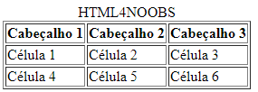

# Tabelas

## O que é uma tabela?

Tabela é o conjunto de linhas e colunas. Uma tabela é utilizada para organizar dados.

## Estrutura de uma tabela em HTML

Para criar uma tabela no HTML é necessário utilizar a tag `<table>` e mais três estruturas que são as tags `<tr>`, `<th>` e `<td>`.

- `<table>`: Define uma estrutura de tabela.
- `<tr>`: Define  uma linha para tabela.
- `<th>`: Define o cabeçalho da tabela.
- `<td>`: Define os dados/células na tabela. 

**Obs: Todas as tags possui fechamento.**

_Sintaxe_
```html
<!DOCTYPE html>

<html>

    <head>
        <title>Minha primeira tabela</title>
        <meta charset="UTF-8">
    </head>

    <body>
        <table border="1">
            <tr> <!-- Linha que contêm os cabeçalhos -->
                <th>Cabeçalho 1</th>
                <th>Cabeçalho 2</th>
                <th>Cabeçalho 3</th>
            </tr>
            <tr> <!-- Linha que contêm os dados/células -->
                <td>Célula 1</td>
                <td>Célula 2</td>
                <td>Célula 3</td>
            </tr>
            <tr> <!-- Linha que contêm os dados/células -->
                <td>Célula 4</td>
                <td>Célula 5</td>
                <td>Célula 6</td>
            </tr>
        </table>
    </body>
</html>
```

Resultado:


## Definir bordas 

Para ter uma visualização melhor da tabela é necessário definir uma borda. Para definir uma borda, use o `border="número"` dentro da tag `<table>`. 

_Sintaxe_
```html
 <table border=" ">
```

Onde:
- Número: Recebe um valor inteiro.

Se a borda da tabela não for definida, teremos o seguinte resultado:


Adicionando a borda, teremos o seguinte resultado:


**Obs: Se o tamanho da borda não for definido, por padrão ele começará com 1.**

## Definir tamanho da tabela 

Para definir o tamanho da tabela, use o `width="tamanho"` dentro da tag `<table>`. 

Onde:
- Tamanho: Recebe o valor para definir o tamanho da tabela .

_Sintaxe_
```html
<!DOCTYPE html>

<html>

    <head>
        <title>Minha primeira tabela</title>
        <meta charset="UTF-8">
    </head>

    <body>
        <table border="1" width="500">
            <tr> 
                <th>Cabeçalho 1</th>
                <th>Cabeçalho 2</th>
                <th>Cabeçalho 3</th>
            </tr>
            <tr> 
                <td>Célula 1</td>
                <td>Célula 2</td>
                <td>Célula 3</td>
            </tr>
            <tr>
                <td>Célula 4</td>
                <td>Célula 5</td>
                <td>Célula 6</td>
            </tr>
        </table>
    </body>
</html>
```

Resultado:


## Expansão de coluna

Quando queremos que uma célula ocupe mais de uma coluna, nós utilizamos o `colspan="número"`. Podemos utilizar o `colspan="número"` dentro das tags `<th>` e `<td>`.

Onde:
- Número: Recebe o número de colunas que uma célula deve se expandir.

Exemplo de tabela sem `colspan`:

_Sintaxe_
```html
<!DOCTYPE html>

<html>

    <head>
        <title>Minha primeira tabela</title>
        <meta charset="UTF-8">
    </head>

    <body>
        <table border="1" width="500">
            <tr>
                <th>Carro</th>
                <th>Cor</th>
            </tr>
            <tr>
                <td>Gol</td>
                <td>Vermelho</td>
                <td>Prata</td>
            </tr>
            <tr>
                <td>Uno</td>
                <td>Preto</td>
                <td>Verde</td>
            </tr>
        </table>
    </body>
</html>
```

Resultado:


Exemplo de tabela com `colspan`:

_Sintaxe_
```html
<!DOCTYPE html>

<html>

    <head>
        <title>Minha primeira tabela</title>
        <meta charset="UTF-8">
    </head>

    <body>
        <table border="1" width="500">
            <tr>
                <th>Carro</th>
                <th colspan="2">Cor</th>
            </tr>
            <tr>
                <td>Gol</td>
                <td>Vermelho</td>
                <td>Prata</td>
            </tr>
            <tr>
                <td>Uno</td>
                <td>Preto</td>
                <td>Verde</td>
            </tr>
        </table>
    </body>
</html>
```

Resultado:


## Expansão de linha

Quando queremos que uma célula ocupe mais de uma linha, nós utilizamos o `rowspan="número"`. Devemos utilizar o `rowspan="número"` dentro da tag `<td>`.

Onde:
- Número: Recebe o número de linhas que uma célula deve se expandir.

Exemplo de tabela sem `rowspan`:

_Sintaxe_
```html
<!DOCTYPE html>

<html>

    <head>
        <title>Minha primeira tabela</title>
        <meta charset="UTF-8">
    </head>

    <body>
        <table border="1" width="500">
            <tr>
                <th>Código</th>
                <th>Produto</th>
                <th>Preço</th>
            </tr>
            <tr>
                <td>01</td>
                <td>Caneca</td>
                <td>R$ 35,00</td>
            </tr>
            <tr>
                <td>02</td>
                <td>Chaveiro</td>
                <td>R$ 6,00</td>
            </tr>
            <tr>
                <td>Desconto</td>
                <td colspan="2">Cupom 1 - R$ 5,00</td>
            </tr>
            <tr>
                <td>Desconto</td>
                <td colspan="2">Cupom 2 - R$ 3,00</td>
            </tr>
            <tr>
                <td>Total:</td>
                <td colspan="2">R$ 33,00</td>
            </tr>
        </table>
    </body>
</html>
```

Resultado:


Exemplo de tabela com `rowspan`:

_Sintaxe_
```html
<!DOCTYPE html>

<html>

    <head>
        <title>Minha primeira tabela</title>
        <meta charset="UTF-8">
    </head>

    <body>
        <table border="1" width="500">
            <tr>
                <th>Código</th>
                <th>Produto</th>
                <th>Preço</th>
            </tr>
            <tr>
                <td>01</td>
                <td>Caneca</td>
                <td>R$ 35,00</td>
            </tr>
            <tr>
                <td>02</td>
                <td>Chaveiro</td>
                <td>R$ 6,00</td>
            </tr>
            <tr>
                <td rowspan="2">Desconto</td>
                <td colspan="2">Cupom 1 - R$ 5,00</td>
            </tr>
            <tr>
                <td colspan="2">Cupom 2 - R$ 3,00</td>
            </tr>
            <tr>
                <td>Total:</td>
                <td colspan="2">R$ 33,00</td>
            </tr>
        </table>
    </body>
</html>
```

Resultado:


## Legenda 

Para adicionar legenda a uma tabela é preciso usar a tag `<caption>` dentro da estrutura `<table>`.

Exemplo:

_Sintaxe_
```html
<!DOCTYPE html>

<html>

    <head>
        <title>Minha primeira tabela</title>
        <meta charset="UTF-8">
    </head>

    <body>
        <table border="1" width="500">
            <caption>HTML4NOOBS</caption>
            <tr> 
                <th>Cabeçalho 1</th>
                <th>Cabeçalho 2</th>
                <th>Cabeçalho 3</th>
            </tr>
            <tr>
                <td>Célula 1</td>
                <td>Célula 2</td>
                <td>Célula 3</td>
            </tr>
            <tr> 
                <td>Célula 4</td>
                <td>Célula 5</td>
                <td>Célula 6</td>
            </tr>
        </table>
    </body>
</html>
```

Resultado:



## Proximo =>
[Tags de Estilo e Script](contents/12.Estilo.md)